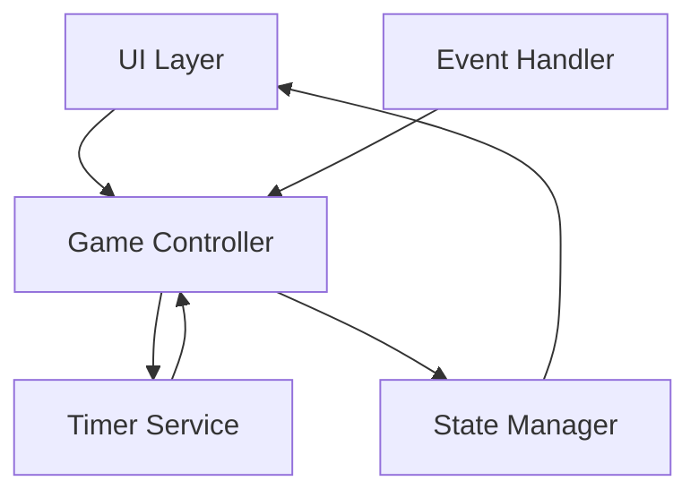
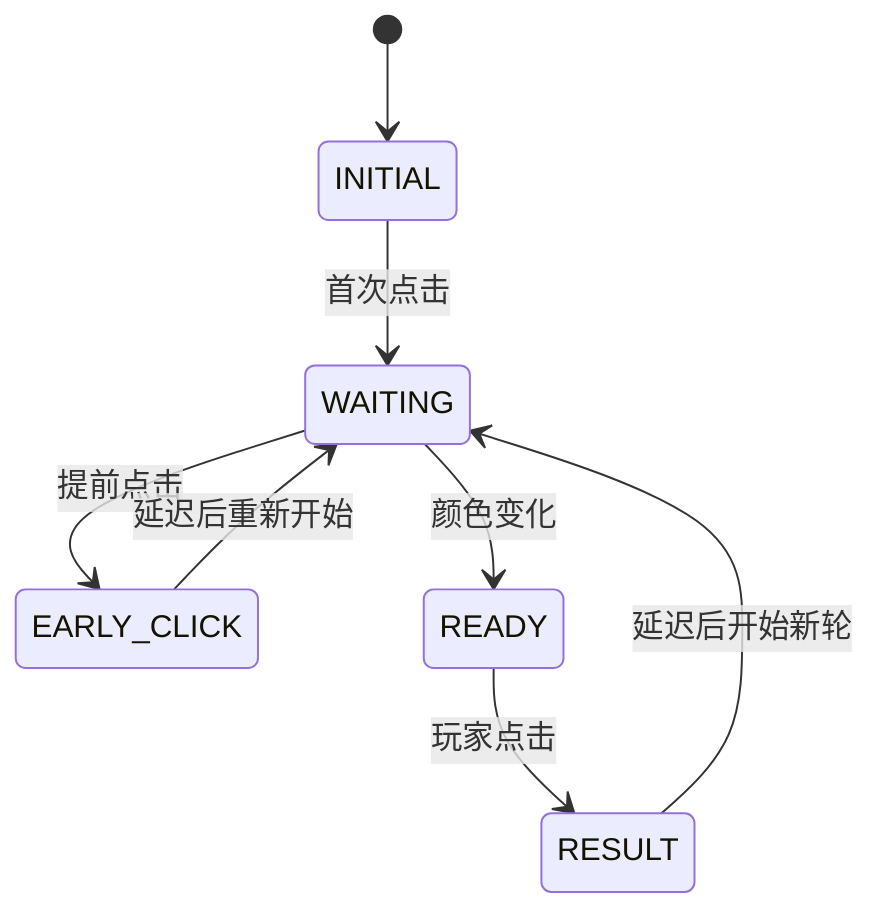

# 设计文档

## 概述

反应速度测试游戏是一个基于浏览器的单页面应用，用于测量用户的视觉反应速度。系统通过在随机时间改变色块颜色，记录用户从看到颜色变化到点击的时间间隔，并提供即时反馈和性能评价。

核心设计原则：
- 精确的时间测量（毫秒级）
- 简洁的用户界面，减少干扰
- 即时反馈机制
- 无需外部依赖的纯前端实现

## 架构

### 系统架构

系统采用事件驱动的单页面应用架构，主要包含以下层次：



### 组件职责

1. **UI Layer**: 负责渲染色块、显示结果和用户交互
2. **Game Controller**: 协调游戏流程，管理游戏状态转换
3. **Timer Service**: 提供高精度时间戳和延迟功能
4. **State Manager**: 管理游戏状态（等待中、准备点击、显示结果等）
5. **Event Handler**: 处理用户点击事件

## 组件和接口

### GameController

游戏控制器是核心组件，负责协调整个游戏流程。

```typescript
interface GameController {
  // 初始化游戏
  initialize(): void;
  
  // 开始新一轮游戏
  startRound(): void;
  
  // 处理玩家点击
  handleClick(): void;
  
  // 重置游戏状态
  reset(): void;
}
```

### TimerService

提供高精度时间测量功能。

```typescript
interface TimerService {
  // 获取当前时间戳（毫秒）
  getCurrentTimestamp(): number;
  
  // 设置延迟执行
  setDelay(callback: () => void, delay: number): void;
  
  // 取消延迟
  cancelDelay(): void;
}
```

### StateManager

管理游戏状态和状态转换。

```typescript
enum GameState {
  INITIAL,        // 初始状态，显示说明
  WAITING,        // 等待颜色变化
  READY,          // 颜色已变化，等待点击
  RESULT,         // 显示结果
  EARLY_CLICK     // 提前点击
}

interface StateManager {
  // 获取当前状态
  getCurrentState(): GameState;
  
  // 设置状态
  setState(state: GameState): void;
  
  // 订阅状态变化
  onStateChange(callback: (state: GameState) => void): void;
}
```

### UIRenderer

负责渲染用户界面。

```typescript
interface UIRenderer {
  // 渲染色块
  renderColorBlock(color: string): void;
  
  // 显示反应时间和评价
  displayResult(reactionTime: number, rating: string): void;
  
  // 显示提示信息
  displayMessage(message: string): void;
  
  // 显示游戏说明
  displayInstructions(): void;
}
```

## 数据模型

### GameRound

表示一轮游戏的数据。

```typescript
interface GameRound {
  // 颜色变化时间戳
  colorChangeTimestamp: number | null;
  
  // 玩家点击时间戳
  clickTimestamp: number | null;
  
  // 反应时间（毫秒）
  reactionTime: number | null;
  
  // 等待时间（毫秒）
  waitingPeriod: number;
  
  // 当前色块颜色
  currentColor: string;
}
```

### PerformanceRating

性能评价的数据结构。

```typescript
interface PerformanceRating {
  // 评价等级
  rating: '优秀' | '良好' | '一般' | '需要提高';
  
  // 反应时间阈值
  threshold: {
    excellent: 200,
    good: 300,
    average: 400
  };
}
```

### GameConfig

游戏配置参数。

```typescript
interface GameConfig {
  // 色块尺寸（像素）
  blockSize: {
    width: number;
    height: number;
  };
  
  // 颜色配置
  colors: {
    initial: string;    // 初始颜色
    changed: string;    // 变化后颜色
  };
  
  // 等待时间范围（毫秒）
  waitingPeriodRange: {
    min: number;
    max: number;
  };
  
  // 轮次间隔（毫秒）
  roundInterval: number;
  
  // 提前点击提示显示时间（毫秒）
  earlyClickMessageDuration: number;
}
```

### 游戏流程




## 正确性属性

*属性是一个特征或行为，应该在系统的所有有效执行中保持为真——本质上是关于系统应该做什么的正式陈述。属性作为人类可读规范和机器可验证正确性保证之间的桥梁。*

### 属性 1: 色块尺寸满足最小要求

*对于任何*渲染的色块，其宽度和高度都应该至少为 200 像素。

**验证需求: 1.2**

### 属性 2: 等待时间在有效范围内

*对于任何*游戏轮次，其等待时间应该在 1000 毫秒到 5000 毫秒之间（包含边界）。

**验证需求: 2.1**

### 属性 3: 等待期结束后颜色改变

*对于任何*游戏轮次，当等待期结束时，色块的颜色应该从初始颜色变为不同的颜色。

**验证需求: 2.2**

### 属性 4: 颜色变化时间戳被记录

*对于任何*颜色变化事件，系统应该记录一个有效的时间戳（非空且为正数）。

**验证需求: 2.4**

### 属性 5: 点击时间戳被记录

*对于任何*在色块区域内的点击事件，系统应该记录一个有效的时间戳（非空且为正数）。

**验证需求: 3.1**

### 属性 6: 提前点击被正确识别和处理

*对于任何*在颜色变化前发生的点击，系统应该识别为提前点击并显示"提前点击"提示信息。

**验证需求: 3.2, 7.1**

### 属性 7: 点击区域验证

*对于任何*点击事件，只有当点击坐标在色块区域内时才应该被视为有效点击。

**验证需求: 3.4**

### 属性 8: 反应时间计算正确性

*对于任何*在颜色变化后的有效点击，反应时间应该等于点击时间戳减去颜色变化时间戳。

**验证需求: 3.3, 4.1**

### 属性 9: 反应时间显示包含单位

*对于任何*显示的反应时间，其文本表示应该包含"毫秒"或"ms"单位标识。

**验证需求: 4.2, 5.2**

### 属性 10: 反应时间显示持久性

*对于任何*游戏轮次的结果显示，反应时间应该保持可见直到下一轮游戏开始（状态变为 WAITING）。

**验证需求: 5.3**

### 属性 11: 性能评价正确性

*对于任何*反应时间值：
- 当时间 < 200ms 时，评价应为"优秀"
- 当 200ms ≤ 时间 < 300ms 时，评价应为"良好"
- 当 300ms ≤ 时间 < 400ms 时，评价应为"一般"
- 当时间 ≥ 400ms 时，评价应为"需要提高"

**验证需求: 6.1, 6.2, 6.3, 6.4**

### 属性 12: 结果同时显示反应时间和评价

*对于任何*游戏轮次的结果显示，应该同时包含反应时间数值和性能评价文本。

**验证需求: 5.1, 6.5**

### 属性 13: 提前点击后游戏重置

*对于任何*提前点击事件，系统应该重新开始当前游戏轮次，重置色块到初始颜色并生成新的等待时间。

**验证需求: 7.2**

### 属性 14: 提前点击提示显示时长

*对于任何*提前点击事件，提示信息应该显示至少 1000 毫秒后才开始新的游戏轮次。

**验证需求: 7.3**

### 属性 15: 游戏轮次自动循环

*对于任何*完成的游戏轮次（显示结果后），系统应该自动开始新的游戏轮次。

**验证需求: 8.1**

### 属性 16: 新轮次色块颜色重置

*对于任何*新开始的游戏轮次，色块颜色应该重置为初始颜色。

**验证需求: 8.2**

### 属性 17: 轮次间隔时间

*对于任何*两个连续的游戏轮次，从前一轮结束到后一轮开始的时间间隔应该至少为 1000 毫秒。

**验证需求: 8.3**

## 错误处理

### 时间戳异常

**场景**: 系统时钟异常或时间戳获取失败

**处理策略**:
- 验证时间戳的有效性（非空、正数、递增）
- 如果时间戳无效，记录错误并重新开始游戏轮次
- 向用户显示友好的错误提示

### 点击事件异常

**场景**: 点击事件对象缺失或坐标信息不完整

**处理策略**:
- 验证事件对象的完整性
- 如果事件无效，忽略该点击并继续当前状态
- 不中断游戏流程

### 状态转换异常

**场景**: 非法的状态转换（如从 RESULT 直接到 READY）

**处理策略**:
- 实现状态机验证，只允许合法的状态转换
- 如果检测到非法转换，重置游戏到 INITIAL 状态
- 记录错误日志用于调试

### DOM 操作异常

**场景**: 色块元素不存在或无法访问

**处理策略**:
- 在初始化时验证所有必需的 DOM 元素
- 如果元素缺失，显示错误信息并停止游戏
- 提供重新初始化的选项

### 定时器异常

**场景**: setTimeout/setInterval 失败或被清除

**处理策略**:
- 保存定时器引用，确保可以正确清除
- 在状态转换时清除旧的定时器
- 如果定时器失败，重新开始游戏轮次

## 测试策略

### 测试方法

本项目采用双重测试方法：

1. **单元测试**: 验证特定示例、边界情况和错误条件
2. **基于属性的测试**: 验证跨所有输入的通用属性

两种测试方法是互补的，共同提供全面的测试覆盖。单元测试捕获具体的错误，基于属性的测试验证一般正确性。

### 单元测试重点

单元测试应该专注于：

- **具体示例**: 
  - 初始化时显示色块和说明（需求 9.1, 9.2）
  - 首次点击启动游戏（需求 9.3）
  - 特定反应时间的评价（如 150ms → "优秀"）

- **边界情况**:
  - 等待时间边界值（1000ms, 5000ms）
  - 评价阈值边界（200ms, 300ms, 400ms）
  - 色块边界点击（边缘坐标）

- **错误条件**:
  - 无效的时间戳
  - 色块外点击
  - 状态转换异常

- **集成点**:
  - 状态管理器与 UI 渲染器的交互
  - 定时器服务与游戏控制器的协调
  - 事件处理器与状态转换的集成

### 基于属性的测试配置

**测试库选择**: 使用 fast-check（JavaScript/TypeScript 的属性测试库）

**配置要求**:
- 每个属性测试至少运行 100 次迭代
- 每个测试必须引用设计文档中的属性
- 标签格式: **Feature: reaction-speed-game, Property {编号}: {属性文本}**

**属性测试重点**:

1. **属性 1-17**: 为每个正确性属性编写一个对应的基于属性的测试
2. **随机输入生成**:
   - 随机反应时间（0-2000ms）
   - 随机等待时间（500-6000ms，包含有效和无效值）
   - 随机点击坐标（色块内外）
   - 随机时间戳序列

3. **不变量验证**:
   - 反应时间 = 点击时间戳 - 颜色变化时间戳
   - 状态转换的合法性
   - 时间间隔的最小值约束

### 测试覆盖目标

- 代码覆盖率: 至少 90%
- 属性测试覆盖: 所有 17 个正确性属性
- 单元测试覆盖: 所有边界情况和错误条件
- 集成测试: 完整的游戏流程（初始化 → 多轮游戏 → 提前点击 → 正常点击）

### 测试工具

- **单元测试框架**: Jest 或 Vitest
- **属性测试库**: fast-check
- **DOM 测试**: @testing-library/dom
- **覆盖率工具**: Istanbul/nyc

### 持续集成

- 所有测试在每次提交时自动运行
- 属性测试使用固定的随机种子以确保可重现性
- 测试失败时，属性测试应该提供最小化的反例
